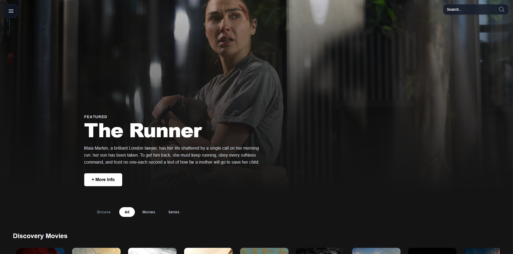
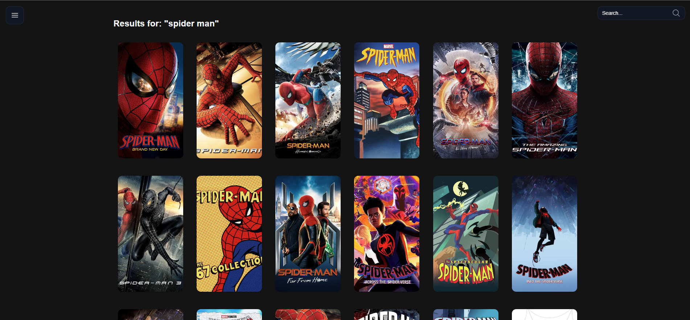
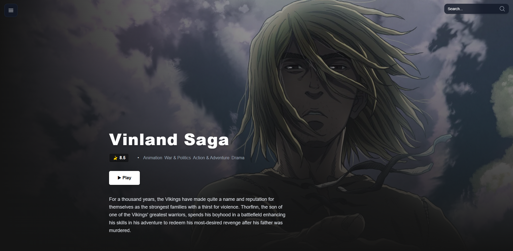

# 🎬 Cineflow

> A Web app built with Next.js for exploring, searching, and viewing details about movies and TV series, powered by the TMDB API.


---

## ✨ Features

- **Featured banner** — dynamic hero section highlighting a trending title, with synopsis and quick actions.
- **Catalog rows** — horizontally scrollable rows for trending, discover (movies/series), top-rated, and upcoming titles.
- **All / Movies / Series filter** — toggle the home feed between combined and media-type-specific views.
- **Search** — search across movies and TV series through a dedicated search page and API route.
- **Detail pages** — immersive, streaming-style pages for movies and series with overview, rating, release date, genres, and cast.
- **Trailer modal** — plays the official YouTube trailer for a title, when available.
- **Light/Dark theme** — theme switching via `next-themes`.

---

## 📸 Screenshots

**Home** — featured banner, All/Movies/Series filter, and discovery rows.


**Search** — results grid for a query.


**Details** — title info, synopsis, and cast.


---

## 🚀 Tech Stack

| Layer | Technology |
|---|---|
| Framework | [Next.js 16](https://nextjs.org/) (App Router, Route Handlers) |
| UI Library | [React 19](https://react.dev/) |
| Language | [TypeScript](https://www.typescriptlang.org/) |
| Styling | [Tailwind CSS 4](https://tailwindcss.com/) |
| Theming | [next-themes](https://github.com/pacocoursey/next-themes) |
| Data Source | [TMDB API](https://www.themoviedb.org/documentation/api) |
| Linting | ESLint 9 (`eslint-config-next`) |
| Hosting | [Vercel](https://vercel.com/) |

---

## 🗂️ Project Structure

```
src/
├── app/
│   ├── (public)/
│   │   ├── layout.tsx          # Public layout (Topbar + theme)
│   │   ├── home/
│   │   │   ├── page.tsx        # Home feed (trending, discover, top-rated, upcoming)
│   │   │   ├── movie/[id]/     # Movie detail page
│   │   │   └── serie/[id]/     # Series detail page
│   │   └── search/page.tsx     # Search results page
│   ├── api/
│   │   ├── movie/              # /api/movie, /trending, /top-rated, /upcoming, /[id], /[id]/credits
│   │   ├── serie/               # /api/serie, /[id], /[id]/credits
│   │   └── multi/               # /api/multi (trending, all), /multi/search
│   ├── components/
│   │   ├── Card.tsx             # Poster card
│   │   ├── CatalogRow.tsx       # Horizontal scrollable row
│   │   ├── Cast.tsx             # Cast list
│   │   ├── TrailerModal.tsx     # YouTube trailer modal
│   │   └── Topbar.tsx           # Nav bar + search + theme toggle
│   └── globals.css
└── services/
    ├── get-movie.ts             # Server-side TMDB movie fetch helper
    └── get-serie.ts             # Server-side TMDB series fetch helper
```

The app proxies all TMDB requests through its own `api/` route handlers rather than calling TMDB directly from the client, keeping the TMDB token server-side.

---

## 🛠️ Getting Started

### Prerequisites

- Node.js 18.18+ (or 20+)
- A free [TMDB API](https://www.themoviedb.org/settings/api) read access token

### 1. Clone the repository

```bash
git clone https://github.com/DavidTelles/Cineflow.git
cd Cineflow
```

### 2. Install dependencies

```bash
npm install
```

### 3. Configure environment variables

Create a `.env.local` file in the project root:

```env
TMDB_API_TOKEN=your_tmdb_read_access_token_here
```

### 4. Run the development server

```bash
npm run dev
```

Open [http://localhost:3000](http://localhost:3000) in your browser.

### Other scripts

```bash
npm run build   # Production build
npm run start   # Run the production build
npm run lint    # Lint the project
```

---

## 🔮 Roadmap

- 👤 **User authentication** — sign-up/login with NextAuth.js, Prisma ORM, and PostgreSQL.
- ❤️ **Favorites** — let authenticated users save/unsave favorite titles.
- 📋 **Watchlist** — a personal "Watch Later" list for tracking pending titles.

---

## 📄 License

This project is licensed under the [MIT License](LICENSE).

## 👨‍💻 Author

Developed by **David Telles**.
